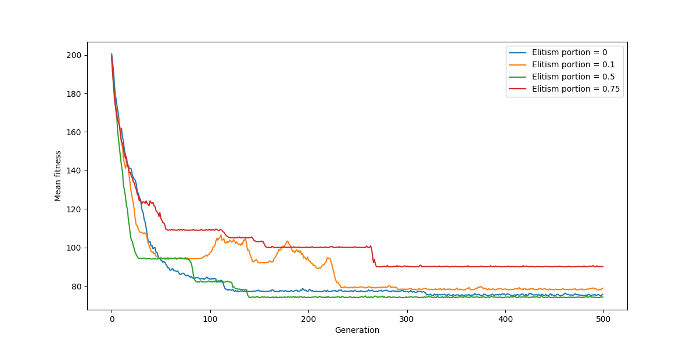

# Genetic algorithm experiments
* [Population Sizes](#experiment-1---population-sizes)
* [Elitism Portions](#experiment-2---elitism-portions)
* [Mutation Rates](#experiment-3---mutation-rates)
* [Selection Methods](#experiment-4---selection-methods)
  - Roulette Wheel
  - Tournament
  - Stochastic Universal
* [Crossover Methods](#experiment-5---crossover-methods)
  - One Point
  - Two Point
  - Uniform
* [Mutation Methods](#experiment-6---mutation-methods)
  - Swap
  - Scramble
  - Inversion

# Experiment 1 - Population sizes
1. population = 50
1. population = 100
1. population = 200

### Conclusion
Bigger population obviously leads to smoother and better outcome, although I would say that this minor improvement of GA with 200 population over the one with 100 didn't worth the time difference between them.

# Experiment 2 - Elitism portions
1. elitism_portion = 0
1. elitism_portion = 0.1
1. elitism_portion = 0.5
1. elitism_portion = 0.75

### Conclusion
It is not that noticeable, but I think that higher elitism portion leads to more "stairs" on the plot. It means that higher elitism means to spikes of improvement rather than smooth improvement. It certainly doesn't hurt to be sure that some portion of next generation will be good candidates. But it is also evident that elitism portion of 0.75 worsens the result because of the lack of diversity caused by transferring majority of previous generation into the next one.

# Experiment 3 - Mutation rates
1. mutation_rate = 0
1. mutation_rate = 0.01
1. mutation_rate = 0.1

### Conclusion
It is evident that higher mutation rate leads to higher "chaos" while executing. While mutation isn't at all necessary in Genetic Algorithm, here we can see that if mutation's chance is 0% the algorithm quickly gets stuck on certain value and doesn't progress, while with 1% the plot looks more spiky which corresponds to more variety and not getting stuck at one value for a long time. 

# Experiment 4 - Selection Methods
1. roulette wheel selection
1. tournament selection
1. stochastic universal selection

All these selection methods were tested with different elitism portions: 0, 0.1 and 0.5 respectively.  

### Conclusion
I wouldn't necessarily say I noticed a big difference when testing different parent selection methods. All three methods implemented do their job reasonably well. It is also more noticeable between these 3 plots that higher elitism values leads to less smoothness and more "stairs". 

 

# Experiment 5 - Crossover Methods
1. one point crossover
1. two point crossover
1. uniform crossover

### Conclusion
We can see that it takes longer for uniform method to come up with optimal solution but it nevertheless does the job. Since two point crossover is just two single-point crossovers with different crossover points, it brings in more opportunity for diversity and hence generally performs a bit better.

 

## Experiment 6 - Mutation Methods
1. swap mutation
1. scramble mutation
1. inversion mutation
All these mutation methods were tested with different mutation rates: 0, 0.01 and 0.1 respectively.  

### Conclusion
It is hard to draw any conclusions from this comparison other than that the swap method plot usually differs from both scramble and inversion. Also it looks like the scramble method usually makes plots more spiky, but even that conclusion is not very evident. 
